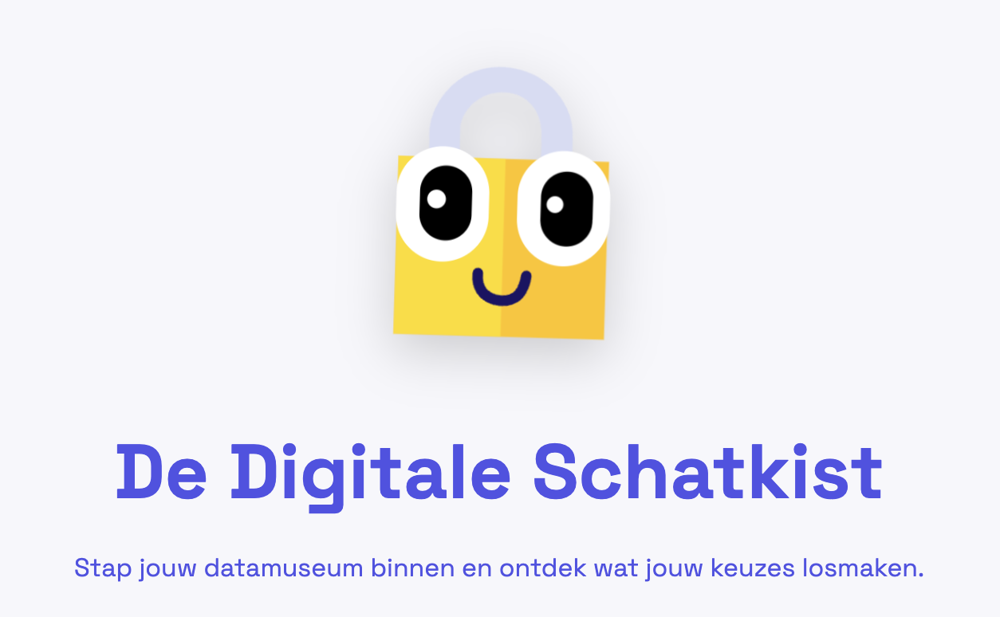
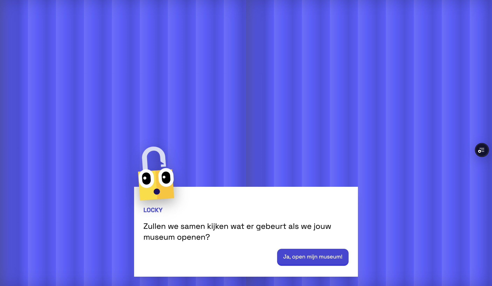

# De Digitale Schatkist

De Digitale Schatkist is een interactieve webapplicatie die jongeren op een laagdrempelige manier laat nadenken over online privacy, data en digitale sporen.



De app gebruikt de metafoor van een **museum** waarin persoonlijke data-objecten worden tentoongesteld. Door te kijken, klikken en ontdekken ervaren gebruikers wat hun online keuzes kunnen zeggen over ze en hoe deze informatie door anderen kan worden bekeken of misbruikt.

> Dit project is ontwikkeld als afstudeerproject en heeft een educatief doel.  
> Er wordt **geen echte persoonlijke data** opgeslagen of verwerkt.

---

## Wat is dit project?

De Digitale Schatkist is bedoeld als leer ervaring en geen les of quiz.  
De gebruikers ervaren hier in de app in plaats van lezen of opdrachten maken.

In de app:
- kies je persoonlijke data-objecten
- zie je hoe deze samen een profiel vormen als een collectie in je museum
- ontdek je mogelijke risico’s
- krijg je concrete tips om slimmer met data om te gaan



Alles gebeurt visueel en interactief, met begeleiding van een mascotte (Locky).

---

## Voor wie?

- Jongeren van ongeveer **9–15 jaar**
- Ouders, docenten en begeleiders
- Iedereen die meer inzicht wil krijgen in online privacy

De toon en inhoud passen zich aan op basis van leeftijd.

---

## Privacy & data

Privacy-by-design staat centraal in dit project:

- Geen accounts
- Geen tracking
- Geen database
- Geen opslag van persoonlijke gegevens

Alles wat je invult blijft lokaal in de browser met localStorage en en eventueel uitgebreid in een sessie storage.

---

## Technologie

Deze applicatie is gebouwd met:

- Nuxt 4
- Vue 3 (Composition API)
- TypeScript
- Tailwind CSS
- Vercel voor deployment

De code is modulair opgezet met herbruikbare componenten en composables.

---

## Installatie

### Vereisten
- Node.js (LTS)
- npm (required)

### Installeren
```bash
npm install